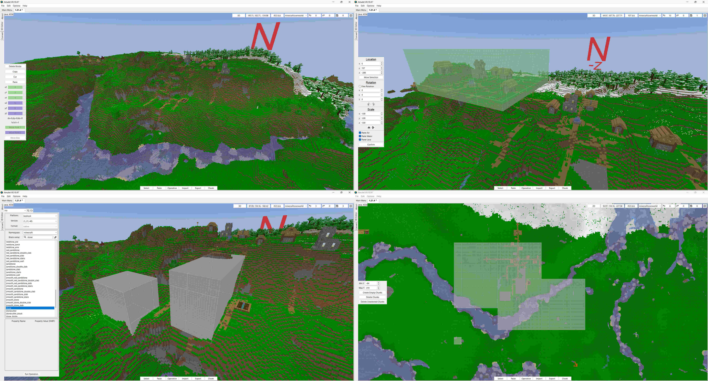

# Amulet Map Editor

A new Minecraft world editor and converter that supports all versions since Java 1.12 and Bedrock 1.7.

## Running compiled builds (Currently Windows only)

Purchase and download the zip file for your operating system from [amuletmc.com](https://www.amuletmc.com). 
Old versions can be found on our [releases page](https://github.com/Amulet-Team/Amulet-Map-Editor/releases).

Extract the contained folder to a location on your computer and run `amulet_app.exe`.

## Running from Source

**If you are running a compiled build you do NOT need to do this.**

Python 3.10+ is required.

### Local Development (Source)
1. Create and activate a virtual environment.
2. Install with pinned constraints for reproducible installs:
   `python -m pip install -e . -c constraints.txt`
3. Run the app:
   `python -m amulet_map_editor`
4. Run tests:
   `python -m unittest discover -v -s tests`
5. Run release smoke tests:
   `python scripts/release_smoke_test.py`
6. Build a wheel:
   `python -m build`

See instructions on [amuletmc.com](https://www.amuletmc.com/installing-from-source)

## Running with Docker (Linux)
The Docker image runs on any Linux distro with Docker support.
To run the Docker image, clone this repository and run `rundocker.sh`.
Compatibility with wayland is done through xwayland for x11 support.

## Contributing

For information about contributing to this project, please read the [contribution](contributing.md) file.
