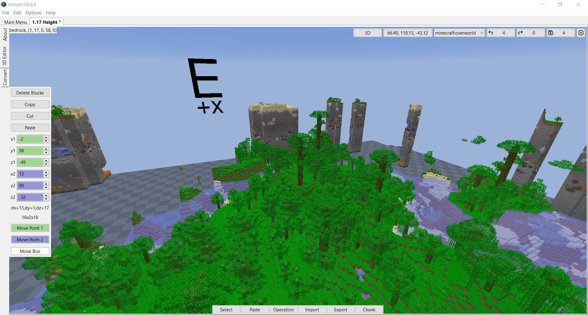

# Edit Program

## About

The edit program is a 3D world editor with similarities to MCEdit Unified. The user can select an area and run various operations on that area.

## Controls

The controls are customizable in `Options` -> `Controls...`, but the defaults are as follows:
- forward: `W`
- backward: `S`
- left: `A`
- right `D`
- down: `Shift`
- up: `Spacebar`
- cursor x-axis: `Left` and `Right`
- cursor y-axis: `Page Down` and `Page Up`
- cursor z-axis: `Up` and `Down`
- camera rotation: `Right mouse button`. Click to toggle, hold to drag.
    - Also changes selection mode. Closest non-air block when not rotating. Fixed distance when rotating.
- select box corner: `Left mouse button`. Click to toggle, hold to drag.
- add new box: `Ctrl` + `Left mouse button`
- deselect: `Ctrl` + `D`
- deselect all: `Ctrl` + `Shift` + `D`
- change select distance: `R` and `F`
- change fly speed: `Scroll wheel`
- inspect block: `Alt`
- change projection: `Tab`
- switch to Select mode: `Ctrl` + `S`
- switch to Paste mode (from clipboard cache): `Ctrl` + `V`
- switch to Operation mode: `Ctrl` + `O`
- Operation mode quick-select:
  - `Ctrl` + `W`: Waterlog
  - `Ctrl` + `Q`: Clone
  - `Ctrl` + `E`: Fill
  - `Ctrl` + `R`: Replace
  - `Ctrl` + `B`: Set Biome
  - `Ctrl` + `F`: focus the operation selector

Rendering and camera options are available in `Options` -> `Options...`.
`Chunk Cache Padding` controls how many extra chunks (beyond render distance) are kept in memory to reduce chunk reload churn at the cost of increased RAM usage.
`Focus Follows Mouse` controls whether moving the mouse over the 3D canvas automatically shifts keyboard focus to the canvas.

The rest of this guide will refer to the default keys.

## File Panel

In the top right is the file panel which will allow you to do a number of useful things.

- Coordinates: This shows your current coordinates. If clicked on will bring up a dialog to type in coordinates to teleport to.
- Dimension: Select which dimension is active
- Undo: Undo the last change. (`Ctrl` + `Z`)
- Redo: Reapply an undone change. (`Ctrl` + `Y`)
- Save: Save all changes to the world. Any changes in the editor are saved in the editor until the user requests them to be saved to the world. (`Ctrl` + `Shift` + `S`)
- Close: Close the current world.

## Tools

At the bottom is a bar of tools. When clicked they will change which tool is active. The tools usually appear on the left.

### Select

The select tool will allow you to create a selection which you can run operations on.

When this tool is active you can left click in the renderer to select boxes.
If you press and hold the left mouse button you can drag a selection box between two places.
You can also quick press the left mouse button to start and stop so you do not have to hold the left mouse button.

Amulet Map Editor is not limited to just one selection box. If you hold `Ctrl` and `Left mouse button` you will be able to add another selection box to the existing selection.
This will allow you to create more complex selections.

Once the selection is created you can resize the selection by clicking on it.
Clicking on a corner or edge will resize the neighbouring faces. 
Clicking on a face will resize just that face.

For finer control you can also use the UI on the left to input coordinates of the green and blue edges.
Hovering on one of these entries and moving the scroll wheel will change these inputs or you can use the arrows in the UI.

Another way to change these locations is to use the move buttons at the bottom of the left UI.
To use these, click on the button and use the movement controls (WASD, Shift and Space by default) which will move that point relative to the camera orientation.
`Move Point 1` and `Move Point 2` will move the green and blue points respectively.
`Move Box` will move both points at the same time causing the whole box to move.

You can also move the active selection box directly with the keyboard using `Left`/`Right` (x),
`Page Down`/`Page Up` (y), and `Up`/`Down` (z) without clicking any move button.

#### Copy and Paste

- Select an area and press the copy button in the select tool or (`Ctrl` + `C`) or (`Edit` -> `Copy`)
- Press the paste button in the select tool or (`Ctrl` + `V`) or (`Edit` -> `Paste`) to choose where to paste the selection in the world. See [paste](#paste) for more information.
- It is worth noting here that Amulet Map Editor is able to have multiple worlds open at the same time and the copied area can be pasted into a different world.
- Our translation system also handles conversion between different world formats so the source and destination worlds do not need to be from the same version or platform.

### Paste

If you have previously copied a selection you paste it into the world (`Ctrl` + `V` or `Edit` > `Paste`) which will bring you to this tool.

You can place the structure down roughly where you want it and use the UI to move it to exactly where you want it.
When pasting from a recent copy/cut, paste mode starts at the copied coordinates (including cross-world and cross-dimension paste) and does not follow the pointer until you click to toggle move mode.
When the structure is not in pointer-follow mode, you can also nudge location with
`Left`/`Right` (x), `Page Down`/`Page Up` (y), and `Up`/`Down` (z).

The UI also allows rotation, scale and mirroring.

Note that blocks with orientation such as stairs will keep the blockstate they had before the rotation making them look weird after the rotation.

### Operations

The operations tool is a place where users can write their own code for use within the editor.

The tool consists of a drop down list of the operations and each operation can define what the rest of the UI looks like.

There are a number of operations that are distributed with Amulet Map Editor.
As of writing they are:
- Fill: Fill the selected box(es) with the chosen block
- Replace: Replace the chosen block in the selected box(es) with another chosen block
- Set Biome: Set the biome of the selected box(es)
- Waterlog: Waterlog the blocks in the selection. The operation contains more information on usage.

#### Fill and Replace

- Select an area of the world you would like the operation to run on.
- Select the operation from the list of operations.
- Fill: Select the block you wish to fill the area with.
- Replace: Build a list of source blocks to match (use * to match any value of that property), select a replacement block, and choose match mode:
  - `Any Of`: replace listed source blocks.
  - `None Of`: replace everything except listed source blocks.
-Run the operation.
-Undo will undo the changes and save will apply them to the world files.

### Import and Export

These tools will allow you to import and export a number of different structure file formats.

Currently the supported formats are `.construction`, `.schematic`, `.schem` and `.mcstructure`

Note that if you just want to copy between worlds you do not need to export to a file.
You can just copy from one world and without closing Amulet Map Editor open the second world and paste it in. 

### Chunk

This tool will allow you to chunk based modifications.

Delete Empty Chunks: Deletes selected chunks that only contain air so Minecraft can regenerate terrain from the world seed next time those chunks are loaded in-game.
Delete Chunks: The chunks in the selected area will be deleted. The game will recreate them next time you visit them in game.
Delete Unselected Chunks: The chunks that are not in the selected area will be deleted. The game will recreate them next time you visit them in game.
